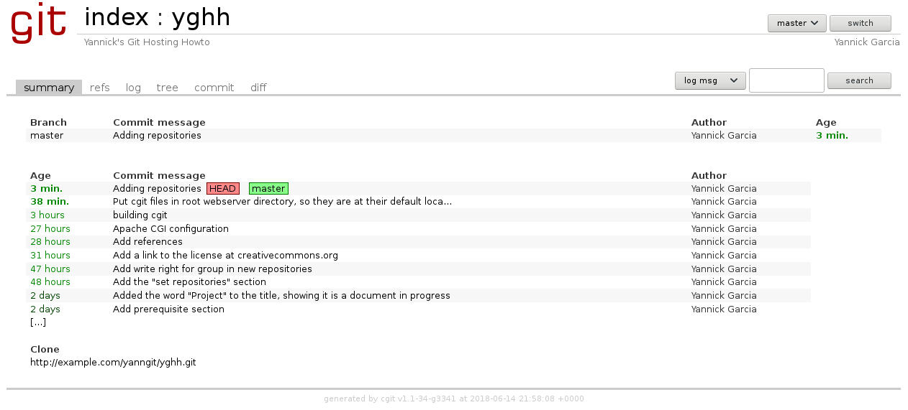

# Yannick's Git Hosting Howto

This document describe one way to host Git repositories on a Linux server.

There are many ways to do this, I present here my way, the one I think is simpler. This is a moving document that can evolute with time. You are free to follow this as a guide if you don't know how to do. Feel free to let me know if you think something is wrong, or make a pull request.

I have reproduced here the commands I have done to install git repositories and `cgit` on a raspberry pi running the raspbian distribution. Althrought the actions to do are generic, following your distribution, some paths or filenames may change.

## Prerequisites

You'll need of course a server with root access. It will be named `example.com` in this document. In the following, replace `example.com` by the name or the IP address of your server.

We'll also used HTTP protocol for anonymous repositories clone. And so a web server must be install on `example.com`. The configurations showned are for the apache server. This Howto doesn't present the configuration for others webservers. Please contribute if you want them to appear.

The git push, will be made over ssh protocol. The sshd deamon is probably already running on your server. If not, install it.

Finally, git must be installed on this server.

## Set the repositories

### set the context

The repositories will be in `/var/www/htdocs`. If the directory does not exits, create it :

    $ sudo mkdir -p /var/www/htdocs

The contents of this directory must be readable at least by the web server, so the repositories will be clonable. I choosed let it be readable by everybody.

The repositories must also be writable by the people which are allowed to push their commits. As this will be made by ssh, these people will have an accounts on the server. We'll name then `users`.

The write rigths will be allowed to groups. First, we create a group `git` which will own by default all the repositories. For this, we put the `setguid` bit on their parent directory :

    $ sudo addgroup git
    $ sudo chgrp git /var/www/htdocs
    $ sudo chmod 2775 /var/www/htdocs

### configure web access to the repositories (only need for anonymous clone)

As `/var/www/htdocs` is not below the root directory of our web server, we must access it by a symlink or an alias. Here we use the alias `yanngit`, so the repositories will be under `http://example.com/yanngit/`.

Add to the file `/etc/apache2/apache.conf` :

    Alias /yanngit/ "/var/www/htdocs/"
    <Directory /var/www/htdocs>
        Options FollowSymLinks
        AllowOverride None
        Require all granted
    </Directory>

Then restart apache deamon to take into account this new configuration.

    $ sudo service apache2 restart

### create a repository

We now want to create the repository `yghh` owned by the user `yannick`.

So we'll create the user `yannick` with group `git`. To prevent this user to obtain a shell (through ssh) on the server, his login shell will be `git-shell`.

If `git-shell` is not in `/etc/shells`, first add it :

    $ sudo which git-shell >> /etc/shells

Then create the user :

    $ sudo useradd -g git -s /usr/bin/git-shell yannick

You may put his public key in `~yannick/.ssh` to not be asked for password. Otherwise set a default password for this user :

    $ sudo passwd yannick

Create now an empty bare repository, and add write rights to group :

    $ sudo mkdir /var/www/htdocs/yghh.git
    $ sudo cd /var/www/htdocs/yghh.git
    $ sudo git init --bare
    $ sudo chmod -R 775 branches objects refs
    $ sudo chmod 775 info
    $ sudo chmod 664 HEAD info/*

For the repository to be clonable by HTTP, you must add a hook for each update. This is not needed if you don't want your repository to be clonable by everyone.

    $ sudo mv hooks/post-update.sample hooks/post-update
    $ sudo ./hooks/post-update
    $ sudo chmod 664 info/* objects/info/*

### clone and push

From an other computer, you can do,

For read only access with HTTP protocol :

    $ git clone http://example.com/yanngit/yghh.git

or

    $ git clone yannick@example.com:/var/www/htdocs/yghh.git

### You did it

If you arrived here, your git hosting is operationnal. Now you can add repositories and users with write access to them.

## Optional web interface with cgit

Now you have a server for hosting yours git repositories. And there is a web server running on it.

So, you may like to browse your repositories and explore the commits in a web interface.

A choise to do this may be `cgit`. `cgit` is a cgi program. This mean it is execute when the webserver receive a HTTP GET request for the file `cgit.cgi`.

For this to work the cgi module must be loaded by apache deamon, and the directory where is the cgi program must be declared as cgi directory. So the web server will execute the program instead of send it to your browser. What will be send is the output generated by the program.

### Apache server configuration for a CGI program

#### Loading cgi module

In your `/etc/apache2/apache2.conf` file uncomment the line beginning by `LoadModule cgid_module`

On a raspberry pi, the equivalent action is made by creating two symlinks :

    $ cd /etc/apache2/mods-enabled/
    $ ln -s ../mods-available/cgid.load .
    $ ln -s ../mods-available/cgid.conf .

#### Adding the cgi directory

add the following in `/etc/apache2/apache2.conf` file :

    ScriptAlias /cgit/ "/var/www/htdocs/cgit/"
    <Directory /var/www/htdocs/cgit>
        Options FollowSymLinks
        AllowOverride None
        Require all granted
    </Directory>

and create the directory :

    $ sudo mkdir /var/www/htdocs/cgit

#### Restarting service

    $ sudo service apache2 restart

### Compiling and installing cgit

It's probably possible with your distribution to install cgit with the packet manager. But for better understand how it works, we'll build and install it ourself. If you don't want to do this, or don't have gcc installed on your server, skip this section and simply do

    $ sudo apt install cgit

Else you can build cgit :

    $ git clone --recursive https://git.zx2c4.com/cgit
    $ cd cgit
    $ make NO_LUA=1

After that, install the program on the webserver :

    $ sudo cp cgit /var/www/htdocs/cgit/cgit.cgi

At this point, the url `http://example.com/cgit/cgit.cgi` must be accessible and present some text.

To make this page nicer, we need to add a css, a logo, and a favicon. Considering the root web server directory is `/var/www/html`, we can put theses files in it :

    $ sudo cp cgit*.css /var/www/html/
    $ sudo cp cgit.png /var/www/html/
    $ sudo cp favicon.ico /var/www/html/

By default, these file are looked for in the root directory on the web server. This can be override in by cgit configuration. See cgitrc manpage for detail.

To avoid error logs for apache, create the directory `/var/cache/cgit` and make it writable for apache

    $ sudo mkdir -p /var/cache/cgit
    $ sudo chgrp www-data /var/cache/cgit
    $ sudo chmod 775 /var/cache/cgit

### Configure your repository

You must declare yours repositories for cgit to be able to show them. For our example, we'll create a file `/etc/cgitrc` with the following content :

    clone-url=http://example.com/yanngit/$CGIT_REPO_URL.git
    repo.url=yghh
    repo.path=/var/www/htdocs/yghh.git
    repo.desc=Yannick's Git Hosting Howto
    repo.owner=Yannick Garcia

You may have as much `repo.*` lines sections as repositories you are hosting.

If you select the project `yghh` in the list of projects now appearing on `http://example.com/cgit/cgit.cgi`, you may see something looking like this :

### Add an icon to you project

You may want to replace the cgit logo at the top-left of the page by another logo. Place this logo on the server, under `/var/www/html/yghh.png`, and edit `/etc/cgitrc`, adding after the line `repo.url=yghh` :

    repo.logo=/yghh.png

### Use cgit filters

In cgit, filters are modifiers for some elements to show in the web interface.

They are not activated by default and they must be added in `/etc/cgitrc`.

You may want to define these three filters :

  * source-filter : this filter is applyed before showing source files content. It is used to highlight syntax.
  * about-filter : this one is for format help text document. For example, convert markdown to formatted html.
  * email-filter : this filter can be used to add an avatar icon to commit author's name.

#### Use the filters included in cgit

Cgit sources provide default filters that you can used. Theses filters need `python3`. You must install `python3` if you want used them. The packages `python3-markdown` and `python3-pygments` are also required.

Copy the filters in a location where apache can find them :

    $ sudo mkdir -p /usr/local/share/cgit
    $ sudo cp -r filters /usr/local/share/cgit/

And add their locations in `cgitrc` file :

    source-filter=/usr/local/share/cgit/filters/syntax-highlighting.py
    about-filter=/usr/local/share/cgit/filters/about-formatting.sh
    email-filter=/usr/local/share/cgit/filters/email-gravatar.py

for the about-filter you must define too the filename of the file to filter. This filename is relative to the repository directory. For example

    readme=:README.md

meaning : file `README.md` on `master` branch

    readme=foo:INSTALL.html

meaning : file `INSTALL.html` on `foo` branch

You may define as `readme=...` as needed to cover all the cases of yours projects.

Is this file is found in the project repository, a `about` tab may appear, showing his filtered (formatted) content, in the web interface of the project.

If you don't see the content of your README document, something went wrong. See `/var/log/apache2/error.log` for detail.

For the images of your project to be include in this formatted page, you also need add some additionals lines to be included in `/etc/cgitrc` :

    ##
    ## List of common mimetypes
    ##
    mimetype.gif=image/gif
    mimetype.html=text/html
    mimetype.jpg=image/jpeg
    mimetype.jpeg=image/jpeg
    mimetype.pdf=application/pdf
    mimetype.png=image/png
    mimetype.svg=image/svg+xml

### Interesting additional config parameters

You'll probably want to define this parameters

  * allow statistics tab : `max-stats=quarter`
  * allow showing number of files affected per commit : `enable-log-filecount=1`
  * allow showing number of lines added/removed per commit : `enable-log-linecount=1`
  * allow showing blame informations : `enable-blame=1`

### final cgit config file

Your config file will finally look like [this](cgitrc).

And you project's main page, like this :

## References

For more informations on git hosting or on cgit, read the following references

  1. [Progit v2](https://git-scm.com/book/en/v2) by Scott Chacon and Ben Straub, chapter 4 : Git on the server
  2. Cgit README, and manpage on [cgit website](https://git.zx2c4.com/cgit/)

## Author

Yannick Garcia - 2018

## License

This work is licensed under the Creative Commons Attribution-ShareAlike 4.0 International License.

To view a copy of this license, visit [http://creativecommons.org/licenses/by-sa/4.0/](http://creativecommons.org/licenses/by-sa/4.0/) or send a letter to Creative Commons, PO Box 1866, Mountain View, CA 94042, USA.
